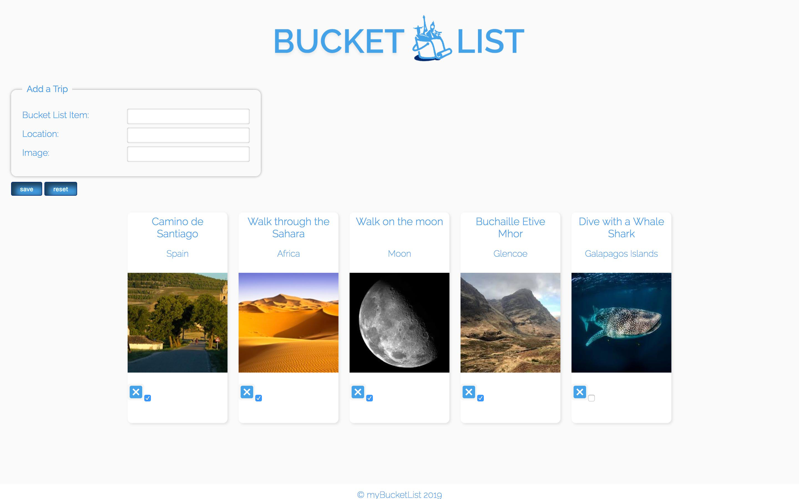

# Full-stack Lab: Bucket List App


### Learning Objectives

- Be able to create a full-stack app
- Practice building a server with a MongoDB for persistence
- Understand the relationship between a client, server and database

## Brief

Build a bucket list browser web-app, that allows a user to create a list of things they want to do in their lifetime. The bucket list items should be stored in a MongoDB via an JSON API in Express.

### MVP

- Users should be able to view all previously saved bucket list items on the page
- Users should be able to submit an item to save it to the database and see it added to the page

### Extensions

- Users should be able to delete bucket list items
- Users should be able to mark list items as "completed" and save the new status
- Style the front-end application with CSS

### Installing

Install dependencies:

```
npm install
```

Run webpack:

```
npm i -D webpack webpack-cli
```
Now run npm run build - this will build the bundle.js file as specified in webconfig.js


```
npm run build
```

### Using

In atom, right click on index.html and choose 'open in browser', the website will now be visible.

#### Screenshot of Beer API website



